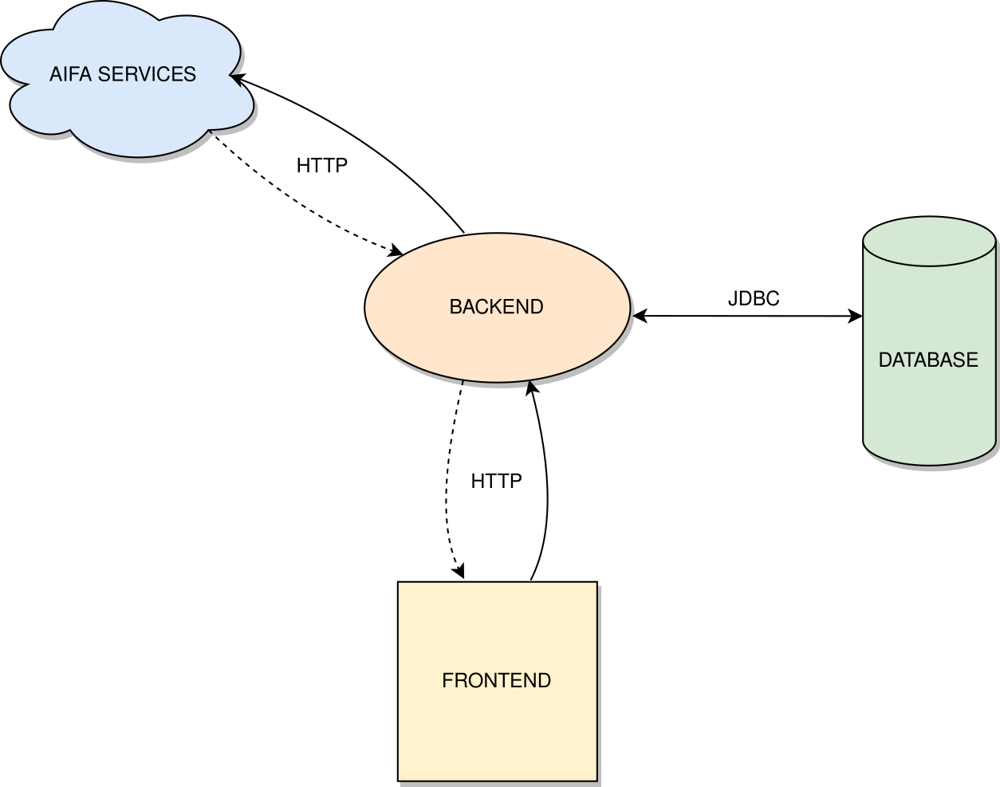
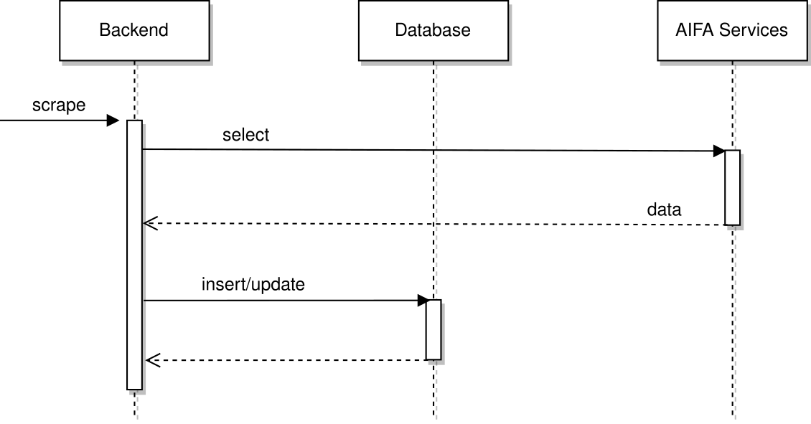
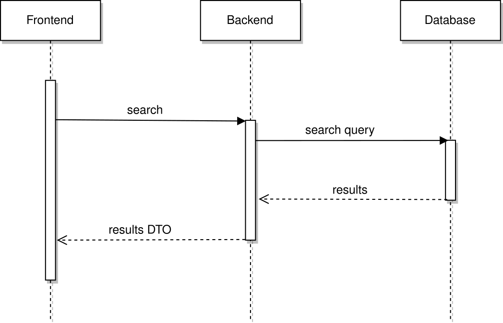
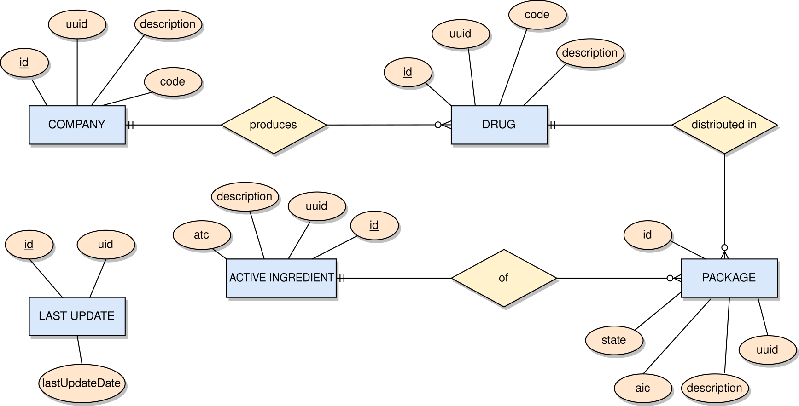
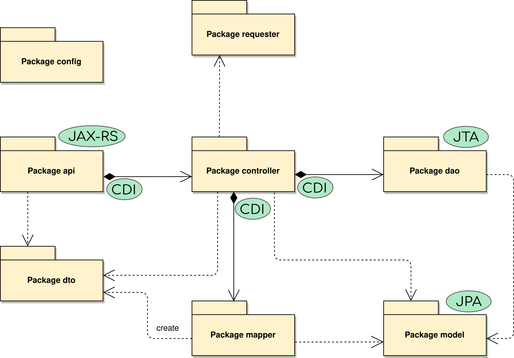
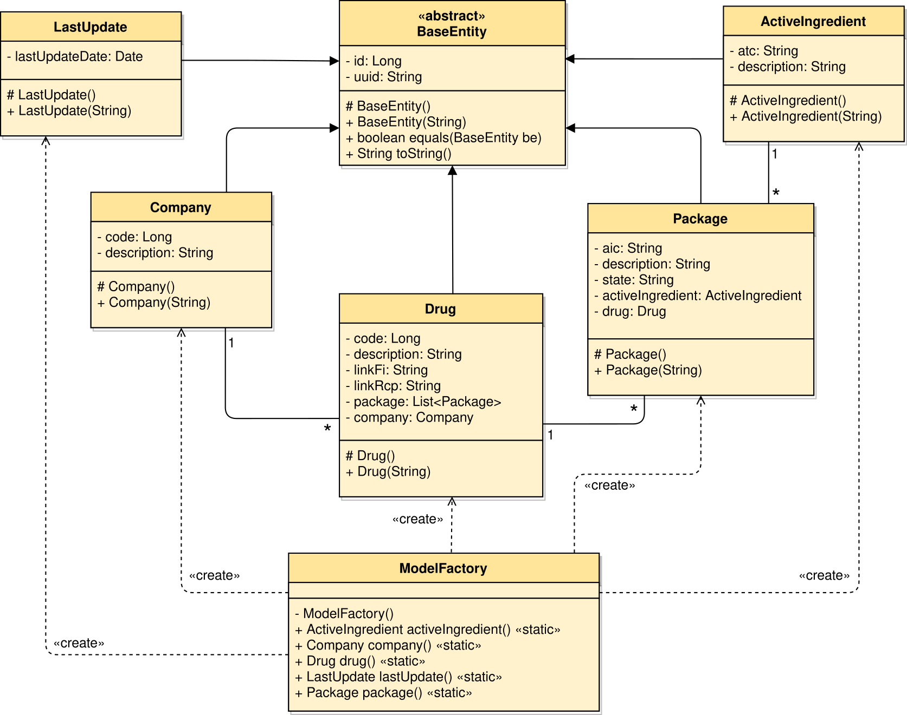
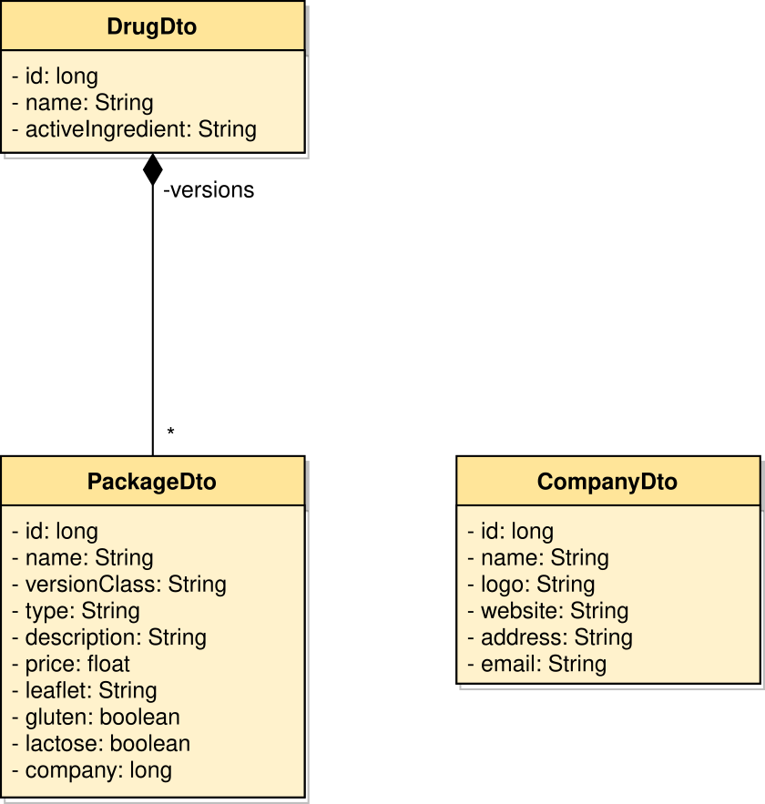

# AIFA scraper

## AIFA
The Italian Medicines Agency (Agenzia italiana del farmaco, AIFA) is the public
institution responsible for the regulatory activity of pharmaceuticals in Italy.
AIFA mantains the only official database of the medicines authorized in Italy.

AIFA provides a web interface to search for drugs by drug name, active
ingredient or company name. This website obtains data from an API service
which unfortunately is not documented for those wishing to use it in their own
applications.

## This project
The final goal is to provide data from the AIFA database through a well-documented API.  
This software is a JavaEE back-end with the following responsibilities:
+ extract the list of AIFA drugs from the (drug) agency website
+ organize them in a reasonable domain model
+ make them accessible with some REST endpoints

Data are persisted in a MariaDB database.

## Requirements
+ JDK 8
+ (optional): Docker, Docker Compose
+ (optional): WildFly, MariaDB

At least one of the two optional requirements must be met.

## Usage

### Compile
Using Gradle, compilation requires just one command:
+ Linux/macOS: `./gradlew war`

+ Windows: `gradlew.bat war`

The compiled artifact `aifa-scraper.war` can be found inside the *build/libs* subdirectory.  
Remark: Gradle is **not** a requirement thanks to the Gradle Wrapper script.

### Run
#### with docker
`docker-compose up`
#### without docker
1. start the DBMS
2. create a database
3. modify datasource configuration in web.xml
4. run WildFly in standalone mode
5. move aifa-scraper.war into standalone/deployments/ subdir of WildFly

### Endpoints
The base url is: `{server-url}/aifa-scraper/api`  
There are five different endpoints:
+ scrape: start the scraping procedure
+ search|medications: search on the database
+ activeIngredients: get all active ingredients (or a specific one)
+ companies: get all companies (or a specific one)
+ drugs: get all drugs (or a specific one)

## Software overview
For detailed documentation check the report file inside the `doc` subdirectory.

### System architecture
We developed the backend and the database, integrating them with AIFA services and
with an existing frontend application.

### Interactions between components
First example of interactions: *scrape*

Second example of interactions: *search*

### Entity-Relationship diagram
Schema of our database (tables are auto-generated using the JPA specification):

### Packages of JEE backend
The software is subdivided into packages, each with different responsibility:

### Domain model
The class diagram of the model package follows directly from the entity-relationship diagram:

### Data Transfer Objects
The class diagram of the DTOs is dictated by the need to be compatible with an
existing client:
